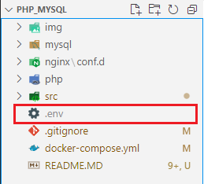
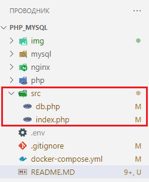
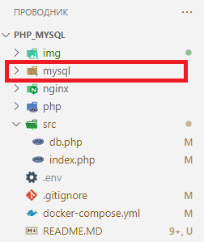

# Описание

Данный проект позволяет развернуть в Docker  работу с тремя сервисами:
 - Nginx
 - MySQL
 - PHP


Сервисы связаны между собой, поэтому в данном проекте можно вести локальную разработку на PHP используя MYSQL в качестве БД.

Проект расчитан на начальный уровень подготовки и не требует особых занний сервисов.

### Подготовка

В корне проекта создать файл с переменными окружения .env:



содержимое файла:
```

MYSQL_ROOT_PASSWORD=123456
MYSQL_DATABASE=test
MYSQL_USER=admin
MYSQL_PASSWORD=123456
```
где:
 - MYSQL_ROOT_PASSWORD - пароль для пользователя root в MySQL.
 - MYSQL_DATABASE - создаваемая базы данных
 - MYSQL_USER - пользователь для базы данных
 - MYSQL_PASSWORD - пароль пользователя

### Запуск

В терминале перейти в каталог php_mysql:

    cd php_mysql

Затем запустить команду:

    docker-compose up -d

После чего открыть страницу можно в браузере:

    http://localhost:8081/

Подключится к БД из любого клиента: 

    БД: это MYSQL_DATABASE
    PORT: 3307
    логин: это MYSQL_USER
    пароль: это MYSQL_PASSWORD

### Работа с PHP

В проекте в папке **src** для примера находятся два php-файла:



В файле **db.php** находится функция "execc" по подключанию и выполнению запросов в MySQL.
В файле **index.php** - пример запроса данных из MySQL.

### Остановка контейнеров

Остановка работы контейнеров осуществляется командой:

    docker-compose down

После остановки контейнеров все данные в базе данных сохраняются локально в папке **mysql**, поэтому данные не исчезнут и при следующем запуске будут снова доступны.


